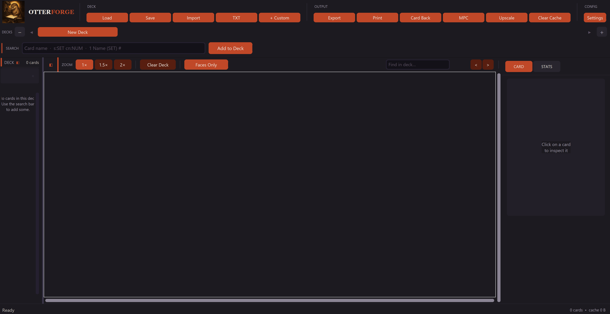

# OtterForge 🃏

> **Create print-ready Magic: The Gathering proxy cards and upload them directly to MakePlayingCards.com — no subscription, no cloud, everything runs on your machine.**

OtterForge is a Windows desktop app that lets you build proxy MTG decks from scratch. Search cards by name, import a full deck list in seconds, optionally upscale them to 1200 DPI with AI, and send the whole thing to MPC with one click.

---

## Download

**[⬇ Download OtterForge v1.4.1 (Windows, ~370 MB)](https://github.com/Etherealburst/OtterForge/releases/tag/v1.4.1)**

Unzip anywhere → double-click `OtterForge.exe` → done. No installation required.

---

## Screenshots


*Main interface — search bar, deck workspace, card inspector panel*


*Deck loaded with cards — Faces Only mode, inspector showing card details and stats*


*Faces + Backs mode — card fronts paired with their backs for DFC review*

---

## Features

- **Card search** — Search any Magic card by name via the Scryfall API (fuzzy matching, set + collector number, Moxfield/Arena format)
- **Bulk import** — Paste or load a `.txt` deck list and import the entire deck at once
- **Folder import** — Import card images directly from a local folder (custom artwork, alter art, unofficial cards)
- **Proxy watermark** — Automatically stamps each card with an OtterForge proxy label (set, CN, artist, year)
- **Double-faced cards** — Both faces are downloaded, stored, and handled automatically (DFC front + back)
- **AI upscaling** — Optional Real-ESRGAN ×4 upscaling to 1200 DPI for sharper prints (requires separate download)
- **Multiple decks** — Work on several decks simultaneously with tabbed navigation
- **Card back management** — Set a global card back per deck, or per-card backs for DFC
- **MPC automation** — One-click upload to MakePlayingCards.com via automated browser (Playwright, already bundled)
- **Print sheet export** — Generate 3×3 print sheets at 300 DPI as PNG + ZIP for home printing or local print shops
- **Undo / Redo** — Full Ctrl+Z / Ctrl+Y support
- **Deck inspector** — Card zoom popup + stats panel (mana curve, card type breakdown)

---

## How to Use

### 1. Search and add cards

Type a card name in the search bar at the top and press **Enter** or click **Add**.

Supported search formats:

| Format | Example |
|--------|---------|
| Card name (fuzzy) | `Lightning Bolt` |
| Set + collector number | `s:m11 cn:149` |
| Moxfield / Arena | `1 Lightning Bolt (M11) 149` |
| Double-faced card | `Delver of Secrets // Insectile Aberration` |
| Name + count | `Lightning Bolt x4` |

Cards are downloaded from Scryfall and cached locally — they never re-download once saved.

---

### 2. Import a full deck list

Click **Import** in the toolbar and select a `.txt` file (Moxfield, Arena, or plain list format).  
OtterForge downloads all cards in parallel and shows a summary of any cards it couldn't find.

**Example deck list format:**
```
4 Lightning Bolt
2 Snapcaster Mage (ISD) 78
1 Delver of Secrets // Insectile Aberration
```

---

### 3. Manage your deck

| Action | How |
|--------|-----|
| Increase / decrease count | **+** / **−** buttons in the sidebar |
| Remove a card | **×** in the sidebar, or select it + **Delete** |
| Select all cards | **Ctrl+A** |
| Delete all selected | **Delete** |
| Reorder cards | **↑ / ↓** arrows in the sidebar |
| Search within deck | Filter bar at the top of the sidebar |
| Zoom in on a card | Click the card image in the workspace |

Decks are **auto-saved** after every change to the `decks/` folder as JSON files.

---

### 4. Set a card back

Click **Card Back** in the toolbar to choose a custom back image for the whole deck.  
Double-faced cards automatically use their printed back face — no setup needed.

---

### 5. Upload to MakePlayingCards.com

1. Click **MPC** in the toolbar
2. Configure the order:
   - **Card stock** — S30 (standard) or S33 (premium)
   - **Log in to MPC** — optional, keeps your order in your account
   - **Background mode** — runs the browser invisibly
   - **Upload backs** — include card backs in the order
3. Click **Start upload**

A browser window opens (or runs silently in the background) and fills in your MPC order automatically. When it finishes, the order is waiting for you to review and check out — OtterForge never charges anything automatically.

> **Note:** MPC orders are priced per card slot in multiples of 18. OtterForge shows you the exact slot count and warns you about any empty slots before uploading.

---

### 6. Export print sheets

Click **Export** to generate 3×3 print sheets (300 DPI PNG + ZIP archive) in the `output/sheets/` folder.  
These are ready for home printing or sending to a local print shop.

---

## AI Upscaling (optional)

By default, OtterForge uses Scryfall images at 300 DPI. For sharper prints, you can enable **Real-ESRGAN** upscaling to 1200 DPI.

**Setup:**
1. Download [Real-ESRGAN ncnn Vulkan](https://github.com/xinntao/Real-ESRGAN/releases) (Windows build)
2. Extract it anywhere on your machine
3. In OtterForge, open **Settings** → **Upscaling** and point it to the folder containing `realesrgan-ncnn-vulkan.exe`

Once configured, all new cards are automatically upscaled to **3288×4488 px** (1200 DPI with bleed) for MPC.  
Already-downloaded cards at 300 DPI continue to work normally.

---

## Keyboard Shortcuts

| Shortcut | Action |
|----------|--------|
| `Ctrl+A` | Select all cards |
| `Delete` | Delete selected card(s) |
| `Ctrl+Z` | Undo |
| `Ctrl+Y` | Redo |
| `Ctrl+B` | Toggle sidebar (normal / compact / hidden) |
| `Escape` | Cancel current selection |

---

## Multiple Decks

- Click **+** (top-right of the deck tab bar) to create a new deck
- **Right-click** a tab to rename or delete it
- Up to 4 tabs are visible at once; use **< >** arrows to scroll between them
- Each deck has its own card back, card list, and auto-save file

---

## File Structure (after first launch)

```
OtterForge/
├── OtterForge.exe
├── README.md
├── cache/
│   └── scryfall/          ← Downloaded card images (never re-downloaded)
├── decks/                 ← Auto-saved deck JSON files
├── card_backs/            ← Your custom back images
└── output/
    ├── sheets/            ← Generated 3×3 print sheet PNGs
    └── exports/           ← ZIP archives ready for distribution
```

---

## Building from Source

If you want to run the Python source directly or build your own exe:

**Requirements:**
- Python 3.11+
- `pip install -r requirements.txt`
- `pip install playwright && playwright install chromium`

**Run:**
```bash
python main.py
```

**Build a standalone exe:**
```bash
pip install pyinstaller playwright
playwright install chromium
build.bat
```

Output: `dist\OtterForge\` — zip and share.

---

## Tech Stack

| Component | Technology |
|-----------|------------|
| GUI | CustomTkinter (dark mode) |
| Card data | [Scryfall API](https://scryfall.com/docs/api) |
| Image processing | Pillow (PIL) |
| AI upscaling | Real-ESRGAN ncnn Vulkan (optional, external) |
| MPC automation | Playwright (Chromium, bundled) |
| Packaging | PyInstaller |

---

## System Requirements

- **OS:** Windows 10 or 11 (64-bit)
- **Internet:** Required for card search and MPC upload
- **Disk space:** ~500 MB for image cache (grows with deck size)
- **GPU:** Not required (Real-ESRGAN upscaling uses GPU if available, falls back to CPU)

---

## Notes

- Card images are fetched from Scryfall and cached locally. Scryfall is a free community resource — don't hammer it with bulk requests unnecessarily.
- OtterForge automates browser interaction with MakePlayingCards.com. If MPC updates their website structure, the automation may break until updated.
- Real-ESRGAN is an optional third-party tool not included in the download. See [their GitHub](https://github.com/xinntao/Real-ESRGAN) for details.

---

*OtterForge is a personal project. Not affiliated with Wizards of the Coast, Scryfall, or MakePlayingCards.com.*  
*Magic: The Gathering card images are © Wizards of the Coast.*
